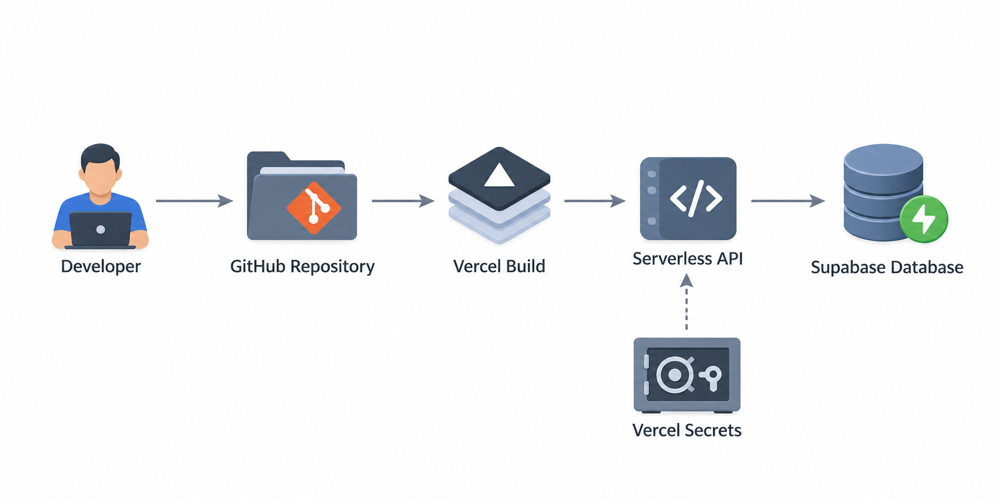

# OnlyDevOps Live

The small, managed-services MVP for OnlyDevOps. Vercel hosts the React app and JavaScript API function; Supabase provides PostgreSQL. The Docker implementation lives in the sibling `onlydevops-poc` repository for the later infrastructure track.



## Deploy

1. In Supabase, open the SQL editor and run `supabase/migrations/20260912000000_onlydevops_core.sql`.
2. Create a Vercel project from this repository.
3. Add these Vercel environment variables for Production, Preview, and Development:

   - `SUPABASE_URL` — `https://knezxorchnyhcopxhbqf.supabase.co`
   - `SUPABASE_SERVICE_ROLE_KEY` — the server-only Supabase service-role key
   - `COOKIE_SECURE` — `true`
   - `ADMIN_USERNAME`, `ADMIN_PASSWORD`, `ADMIN_AUTHCODE` — private admin credentials
   - `ADMIN_SECRET` — a long random secret used to sign the admin cookie

4. Deploy. `vercel.json` builds `frontend/dist`; the catch-all `api/[...path].js` function handles `/api/*`.

The private admin dashboard is available at `/admin`. It reports registrations, active sessions, learning activity, practice accuracy, and a 14-day registration trend. Keep all `ADMIN_*` values server-only and change them if they are ever exposed.

The service-role key must never be prefixed with `VITE_` or exposed in frontend code. Rotate it immediately if it is ever committed or pasted into a browser.

## Local preview

```sh
npm --prefix frontend ci
npm --prefix frontend run dev
```

The frontend proxy points to the existing Docker API at `http://localhost:8088`. For a deployed preview, the JavaScript function requires the Supabase environment variables above.

## MVP scope

The live track includes the syllabus checklist, troubleshooting practice, guest progress, username/password accounts, progress import, light/dark themes, keyboard navigation, and responsive layouts. The JavaScript function keeps the current API contract so the UI does not need a second rewrite.

Correct practice answers stay in the server function. Public database roles have no access to application tables; the function uses the service role server-side. The next security iteration should move account identity to Supabase Auth and use JWT-backed ownership policies before accepting payments or sensitive user data.

## Cost and limits

Vercel Hobby is limited to personal, non-commercial use, so a paid product needs Vercel Pro or another commercial host. Supabase Free is suitable for a small beta but can pause inactive projects and does not include automatic backups. Export the database regularly until the project moves to a paid plan.
